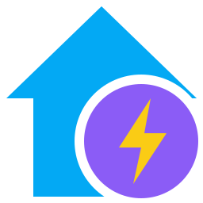

<p align="center">
  
</p>

<h1 align="center">Energy Display</h1>

<p align="center">
  <a href="https://github.com/hawkinslabdev/energydisplay/actions/workflows/tests.yml"></a>
  <a href="https://github.com/hawkinslabdev/energydisplay/actions/workflows/docker.yml"></a>
  <a href="https://github.com/hawkinslabdev/energydisplay/pkgs/container/energydisplay"></a>
  <a href="LICENSE"></a>
</p>

A self-hosted wall display for real-time power and daily energy, gas, and water usage. Reads directly from Home Assistant or a HomeWizard P1 Meter.


## Quick Start

### 1. Requirements

Gather your credentials before starting:

- **Home Assistant:** Server URL and a long-lived access token (**Profile** > **Security**).
- **HomeWizard P1:** IP address of the P1 Meter on your local network.

That's all you need to get started.

### 2. Install and Run

Run the interactive setup script to generate `.env` and `docker-compose.yml`:

```bash
curl -fsSL https://raw.githubusercontent.com/hawkinslabdev/energydisplay/HEAD/install.sh | sh
```

Start the application:

```bash
docker compose up -d
```

Access the dashboard at `http://localhost:9123`.

## Configuration

All configuration is managed through environment variables in `.env`.

<b>General settings</b>

| Variable | Description |
| --- | --- |
| `ADAPTER` | `default` (alias `homeassistant`, `haos`) or `homewizard`. Unknown values use Home Assistant and are logged. |
| `TZ` | Time zone that defines midnight for daily totals, e.g. `Europe/Amsterdam` |
| `FRAME_ANCESTORS` | Additional origins allowed to embed the display in an iframe, space- or comma-separated. |

<details>
<summary>Home Assistant</summary>

<br>

`ADAPTER=default` reads entities and statistics from Home Assistant.

**Connection**

| Variable | Description |
| --- | --- |
| `HOMEASSISTANT_URL` | Home Assistant base URL, e.g. `http://homeassistant.local:8123`. Alias: `HA_URL`. |
| `HOMEASSISTANT_TOKEN` | Long-lived access token. Alias: `HA_TOKEN`. |
| `AUTODISCOVER` | `false` disables autodiscovery. Default: `true`. |

URL and token are required. Entities come from autodiscovery, entity variables, or both.

**Autodiscovery**

Autodiscovery runs at startup and reads the Home Assistant Energy dashboard. Entity variables take precedence.

| Value | Source |
| --- | --- |
| Grid import and export, solar, gas, water, battery state of charge, battery energy in and out, gas price, gas and electricity cost statistics | Energy dashboard |
| Power | Energy dashboard grid power; otherwise the power sensor on the grid import meter's device |
| Temperature | `weather.forecast_*` entity, otherwise the first `weather.*` entity |

**Entities**

Explicitly configure or override entities (supports comma-separated lists to sum multiple sensors):

| Variable | Description |
| --- | --- |
| `POWER` | Current power sensor (W or kW) |
| `ENERGY_IMPORT` | Total imported energy sensor (kWh or Wh) |
| `ENERGY_EXPORT` | Total exported energy sensor (kWh or Wh) |
| `SOLAR` | Total or daily solar production sensor (kWh or Wh) |
| `SOLAR_POWER` | Solar power sensor (W or kW). Not autodiscovered. |
| `GAS` | Total gas sensor (m³) |
| `WATER` | Total water sensor (m³ or L; m³ is converted to L) |
| `TEMPERATURE` | Temperature sensor (°C), or a `weather.*` entity (reads its `temperature` attribute) |
| `BATTERY` | Battery state of charge sensor (%) |
| `BATTERY_POWER` | Battery power sensor (W or kW; negative while charging). Not autodiscovered. |

</details>

<details>
<summary>HomeWizard P1 Meter</summary>

<br>

`ADAPTER=homewizard` reads a HomeWizard P1 Meter directly, without Home Assistant.

**Connection**

| Variable | Description |
| --- | --- |
| `HOMEWIZARD_HOST` | IP address or hostname of the P1 Meter |
| `HOMEWIZARD_TOKEN` | API v2 token. Unset: API v1 over HTTP, which requires **Local API** in the HomeWizard app. |

**Note:** HomeWizard is retiring API v1. It works until HomeWizard ends support; no end date is announced. Use API v2 by setting `HOMEWIZARD_TOKEN`.

API v2 token, after pressing the button on the P1 Meter:

```bash
curl -k -X POST https://<host>/api/user -H 'Content-Type: application/json' -H 'X-Api-Version: 2' -d '{"name":"local/energydisplay"}'
```

API v2 connections are verified against the HomeWizard CA certificate.

The P1 Meter provides power, grid import and export, and gas and water from meters connected to it. Solar, temperature and battery are not available.

</details>

<details>
<summary>Prices</summary>

<br>

Used for gas and electricity cost with both adapters. With Home Assistant, cost statistics from the Energy dashboard take precedence.

| Variable | Description |
| --- | --- |
| `GAS_PRICE` | Price per m³ gas |
| `ELECTRICITY_PRICE` | Price per kWh imported |
| `ELECTRICITY_COMPENSATION` | Price per kWh exported, subtracted from the electricity cost. Default: 0. |

</details>

<details>
<summary>Layout</summary>

<br>

`LAYOUT` sets the layout. `?layout=` overrides it per display, e.g. `http://host:9123/?layout=flow`.

| Value | Shows | Uses |
| --- | --- | --- |
| `classic` | Three wheels, grid today and four bars (default) | `WHEEL1`–`WHEEL3`, `BAR1`–`BAR4` |
| `flow` | Grid, solar, battery and home nodes with live power paths | `POWER`, optional `SOLAR_POWER` and `BATTERY_POWER` |
| `timeline` | Live power, grid and solar today, a chart of today's grid and solar power, and the bars | `POWER`, optional `SOLAR_POWER`, `BAR1`–`BAR4` |
| `tiles` | Every configured gauge as a titled bar | All configured entities |

</details>

<details>
<summary>Wheels and bars</summary>

<br>

| Variable | Position | Default |
| --- | --- | --- |
| `WHEEL1` | Large wheel | `power` |
| `WHEEL2` | Top small wheel | `water` |
| `WHEEL3` | Bottom small wheel | `gas` |
| `BAR1` | First bar | `gas_cost` |
| `BAR2` | Second bar | `solar` |
| `BAR3` | Third bar | `temperature` |
| `BAR4` | Fourth bar | `battery` |

| Value | Shows | Requires |
| --- | --- | --- |
| `power` | Current power (W) | `POWER` |
| `water` | Water usage today (L) | `WATER` |
| `gas` | Gas usage today (m³) | `GAS` |
| `grid` | Net import (positive) or export (negative) today (kWh) | `ENERGY_IMPORT`, `ENERGY_EXPORT` |
| `solar` | Solar production today (kWh); current production with `SOLAR_POWER` | `SOLAR` |
| `self_consumption` | Self-consumed solar energy today (%), as in the Energy dashboard gauge. Battery flows require autodiscovery. | `SOLAR`, `ENERGY_EXPORT` |
| `self_sufficiency` | Self-sufficiency today (%), as in the Energy dashboard gauge. Battery flows require autodiscovery. | `ENERGY_IMPORT`, `SOLAR` |
| `gas_cost` | Gas cost today (€): cost statistics, otherwise gas × `GAS_PRICE` | `GAS` |
| `electricity_cost` | Electricity cost today (€): cost statistics, otherwise import × `ELECTRICITY_PRICE` − export × `ELECTRICITY_COMPENSATION` | `ENERGY_IMPORT` |
| `temperature` | Current temperature (°C) | `TEMPERATURE` |
| `battery` | Battery state of charge (%); charge (↑) or discharge (↓) power with `BATTERY_POWER` | `BATTERY` |

Unconfigured metrics fall back to available options or hide automatically.

</details>

## Troubleshooting


<details>
<summary>Having trouble connecting?</summary>

<br>

An unreachable host, rejected token or 10-second timeout returns HTTP 502 and an error line at the bottom of the screen. Details are in the container log:

```bash
docker compose logs energydisplay
```

</details>

<details>
<summary>Why is there a dash instead of a number?</summary>

<br>

A dash (`–`) means the value has no entity, or its entity has no numeric state. `/api/state` lists:

- `entities`: entity IDs in use, from environment variables or autodiscovery.
- `unavailable`: entity IDs without a numeric state.

</details>

<details>
<summary>Can I change the adapter?</summary>

<br>

Yes. Set `ADAPTER` in `.env` and restart the container; the adapter is read once at startup:

```bash
docker compose up -d --force-recreate
```

`ADAPTER=homewizard` requires `HOMEWIZARD_HOST`. The P1 Meter has no solar, temperature or battery source: positions that default to these show another available value, and positions set to these explicitly show a dash (wheels) or are hidden (bars).

</details>

## Contributing

Contributions are welcome! Please open an issue to discuss any proposed changes or identified issues.

## License

This project is licensed under EUPL 1.2.
